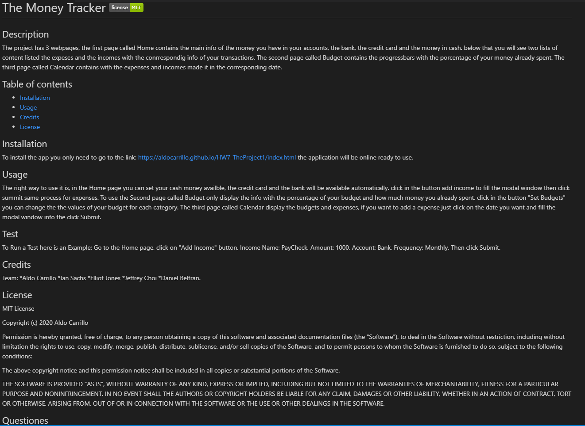

# HW9-ReadMeGenerator 
     

## Description
This projects helps the programmer to generate a readme for each project, once you want to create a readme just run this program with node, it will provide you what to
need to contain in the readme, you just asnwer each questione like title, description, credits etc. then you will get a .md file ready to use.

## Table of contents

* [Installation](#installation)
* [Usage](#usage)
* [Credits](#credits)
* [License](#license)
* [Questiones](#Questiones)

## Installation
Run the terminal the main file called "index.js" with Node.

## Usage 
Follow the Questiones and provide the right Answer that way the program will save yout info in the right way.
* Title of the ReadME
* Description 
* Installation instructions
* The Usage of the program
* How to Run a test
* List the credits
* Which License area you going to use
* GitHub and email for Questions

## Test
"Node index.js"

"Title of the README:" Readme Generator

"Description:" This is a ReadMe generator

### Video Example

* link to Full Video: https://drive.google.com/file/d/1BdZIPsvf9iepLH22f40qDvQeOBSKR9xz/view?usp=sharing

### ScreenShot Example

## Credits
* Aldo Carrillo 

## License

MIT License

Copyright (c)   2020 Aldo Carrillo

Permission is hereby granted, free of charge, to any person obtaining a copy
of this software and associated documentation files (the "Software"), to deal
in the Software without restriction, including without limitation the rights
to use, copy, modify, merge, publish, distribute, sublicense, and/or sell
copies of the Software, and to permit persons to whom the Software is
furnished to do so, subject to the following conditions:

The above copyright notice and this permission notice shall be included in all
copies or substantial portions of the Software.

THE SOFTWARE IS PROVIDED "AS IS", WITHOUT WARRANTY OF ANY KIND, EXPRESS OR
IMPLIED, INCLUDING BUT NOT LIMITED TO THE WARRANTIES OF MERCHANTABILITY,
FITNESS FOR A PARTICULAR PURPOSE AND NONINFRINGEMENT. IN NO EVENT SHALL THE
AUTHORS OR COPYRIGHT HOLDERS BE LIABLE FOR ANY CLAIM, DAMAGES OR OTHER
LIABILITY, WHETHER IN AN ACTION OF CONTRACT, TORT OR OTHERWISE, ARISING FROM,
OUT OF OR IN CONNECTION WITH THE SOFTWARE OR THE USE OR OTHER DEALINGS IN THE
SOFTWARE.

## Questiones

* GitHub link: https://github.com/AldoCarrillo
* Email: aldo.carrillo22@gmail.com

